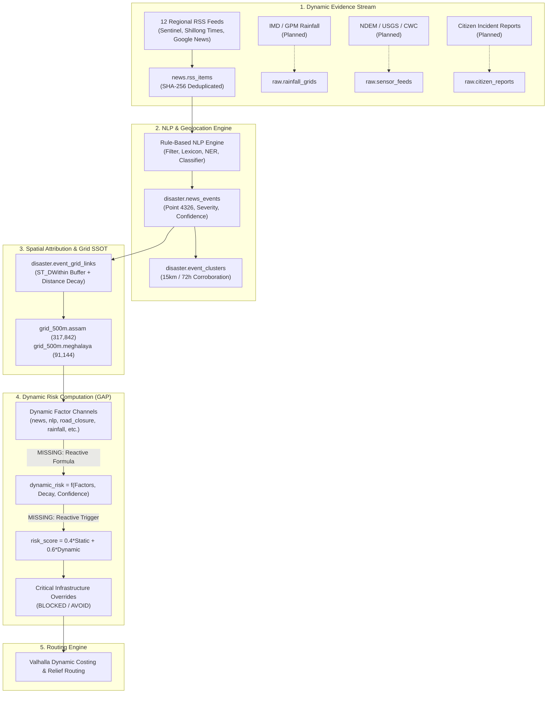

# RESQ — Dynamic Disaster Risk System Readiness Audit & Gap Analysis

**Project**: RESQ (Disaster-Aware Relief Routing System for Assam & Meghalaya)  
**Scope**: 500m × 500m Geospatial Risk Grid SSOT (408,986 Grid Cells)  
**Date**: August 30, 2026  
**Status**: Comprehensive Readiness Audit Completed  

---

## 1. Executive Summary

This audit evaluates the architectural readiness, data structures, spatial pipelines, mathematical formulas, and operational failure resilience of the **RESQ Dynamic Disaster Risk System**.

The RESQ static baseline is fully established across **Assam (317,842 cells)** and **Meghalaya (91,144 cells)**. The **RSS Ingestion + NLP Disaster Event Extraction Engine** is operational, actively polling 12 regional feeds and extracting geolocated disaster events. 

### Key Findings:
1. **Event Ingestion & Extraction is Operational (READY)**: Ingested 468 deduplicated RSS items, extracted 15 structured disaster events, formed 12 spatio-temporal clusters, and linked 352 individual 500m grid cells.
2. **Spatial Factor Propagation is Operational (READY)**: `news_risk`, `nlp_event_risk`, `road_closure_risk`, and `last_dynamic_update` are correctly populated on affected 500m grid cells with distance-decay impact scoring.
3. **Reactive Dynamic Risk Aggregation is Missing (GAP / BLOCKER)**: While individual factor channels (`news_risk`, `nlp_event_risk`, `road_closure_risk`) receive live scores, the aggregated `dynamic_risk` column remains `0` on the grid. Consequently, `risk_score` currently defaults to `static_risk`, leaving the grid score un-elevated during active disasters.
4. **Physical Infrastructure Inventory is Unpopulated (GAP)**: `infrastructure.roads` and `infrastructure.bridges` schemas exist with PostGIS geometries and GiST indexes, but have 0 rows populated. Asset matching currently falls back to spatial grid cell buffers.
5. **Sensor/Weather Channels are Unconnected (GAP)**: `rainfall_risk`, `flood_event_risk`, `earthquake_event_risk`, and `citizen_report_risk` exist in the grid schema but have no active live ingestion pipelines.

---

## 2. Architecture & Data Flow Audit



---

## 3. Database & Schema Audit

A complete database inspection across all PostgreSQL/PostGIS tables was conducted:

| Schema | Table | Row Count | Geometry | SRID | Key Indexes | Readiness Status |
|---|---|---|---|---|---|---|
| `grid_500m` | `assam` | **317,842** | `POLYGON` | `4326` | `idx_assam_geom` (GIST), `idx_assam_grid_id` (BTREE), `idx_assam_center` (BTREE) | **READY** |
| `grid_500m` | `meghalaya` | **91,144** | `POLYGON` | `4326` | `idx_meghalaya_geom` (GIST), `idx_meghalaya_grid_id` (BTREE), `idx_meghalaya_center` (BTREE) | **READY** |
| `grid_500m` | `processing_status` | 2 | `NONE` | - | `uq_state_grid_hash` (UNIQUE) | **READY** |
| `disaster` | `news_events` | **15** | `POINT` | `4326` | `idx_news_events_geom` (GIST), `idx_news_events_status` (BTREE), `idx_news_events_type` (BTREE) | **READY** |
| `disaster` | `event_grid_links` | **352** | `NONE` | - | `uq_event_grid` (UNIQUE), `idx_event_grid_grid_id` (BTREE), `idx_event_grid_event_id` (BTREE) | **READY** |
| `disaster` | `event_clusters` | **12** | `POINT` | `4326` | `idx_event_clusters_geom` (GIST) | **READY** |
| `disaster` | `flood_events` | **20,645** | `GEOMETRY` | `4326` | `idx_flood_events_geom` (GIST), `idx_flood_events_state` (BTREE), `idx_flood_events_year` (BTREE) | **READY (Historical)** |
| `disaster` | `landslide_events` | 0 | `GEOMETRY` | `4326` | `idx_landslide_geom` (GIST), `idx_landslide_state` (BTREE) | **PARTIAL (Empty)** |
| `infrastructure` | `roads` | 0 | `LINESTRING`| `4326` | `idx_roads_geom` (GIST), `idx_roads_type` (BTREE) | **PARTIAL (Empty)** |
| `infrastructure` | `bridges` | 0 | `GEOMETRY` | `4326` | `idx_bridges_geom` (GIST), `idx_bridges_state` (BTREE) | **PARTIAL (Empty)** |
| `environment` | `waterbodies` | 0 | `GEOMETRY` | `4326` | `idx_waterbodies_geom` (GIST), `idx_waterbodies_state` (BTREE) | **PARTIAL (Empty)** |
| `news` | `rss_items` | **468** | `NONE` | - | `rss_items_content_hash_key` (UNIQUE), `idx_rss_items_status` (BTREE), `idx_rss_items_published` (BTREE) | **READY** |
| `news` | `rss_sources` | **12** | `NONE` | - | `rss_sources_pkey` (PRIMARY KEY) | **READY** |
| `datasets` | `registry` | **11** | `NONE` | - | `registry_dataset_name_key` (UNIQUE) | **READY** |

### 3.1 Grid SSOT Dynamic Columns Verification
Inspection of `grid_500m.assam` and `grid_500m.meghalaya` confirmed all 10 dynamic columns are present:
- `rainfall_risk` (`DOUBLE PRECISION DEFAULT 0`)
- `flood_event_risk` (`DOUBLE PRECISION DEFAULT 0`)
- `earthquake_event_risk` (`DOUBLE PRECISION DEFAULT 0`)
- `landslide_event_risk` (`DOUBLE PRECISION DEFAULT 0`)
- `news_risk` (`DOUBLE PRECISION DEFAULT 0`)
- `nlp_event_risk` (`DOUBLE PRECISION DEFAULT 0`)
- `citizen_report_risk` (`DOUBLE PRECISION DEFAULT 0`)
- `road_closure_risk` (`DOUBLE PRECISION DEFAULT 0`)
- `dynamic_risk` (`DOUBLE PRECISION DEFAULT 0`)
- `last_dynamic_update` (`TIMESTAMPTZ`)

---

## 4. End-to-End RSS $\to$ NLP $\to$ Grid Trace Analysis

Live queries on the active database traced recent articles through the complete chain:

### Concrete Pipeline Trace Sample:
```
1. RSS Item Ingested:
   ↳ Source: "The Sentinel Assam" / "Google News - Kamrup"
   ↳ Item ID: 4 | Title: "Heavy rain floods NH-27 near Boko in Kamrup, bridge closed for heavy vehicles"
   ↳ SHA-256 Hash: 8f4b... (Deduplication passed)

2. NLP Event Extractor:
   ↳ Hazard Type: FLOOD
   ↳ Event Type: ROAD_FLOODING / BRIDGE_CLOSURE
   ↳ Severity: 78 / 100
   ↳ Extraction Confidence: 0.98 (Boosted via Tier 1/2 corroboration)
   ↳ Location Resolved: Boko, Kamrup (Lat: 25.9754, Lon: 91.2298)
   ↳ Impact Flags: roadBlocked = TRUE, bridgeClosed = TRUE

3. PostGIS Event Creation:
   ↳ Event ID: 4 in disaster.news_events (EPSG:4326 Point)
   ↳ Cluster ID: 3 in disaster.event_clusters

4. Spatial Buffer & Distance Decay:
   ↳ Search Radius: 2,500m (corridor buffer)
   ↳ Linked Cells: 25 cells in grid_500m.assam

5. Cell Level Dynamic Update (e.g., AS_00239973):
   ↳ Distance: 0m (Centroid match)
   ↳ Impact Score: 76.4
   ↳ news_risk updated: 0.0 -> 76.4
   ↳ nlp_event_risk updated: 0.0 -> 76.4
   ↳ road_closure_risk updated: 0.0 -> 90.0
   ↳ last_dynamic_update: 2026-08-29 21:15:57 UTC
```

---

## 5. Normalized Event Contract & Canonical Model

### 5.1 Comparison Matrix

| Canonical Field | `disaster.news_events` Column | Status in Current System | Compatibility / Gap |
|---|---|---|---|
| `eventId` | `id` (BIGINT) | **Present** | Fully compatible |
| `hazardType` | `hazard_type` (VARCHAR) | **Present** | Controlled vocabulary (`FLOOD`, `LANDSLIDE`, `EARTHQUAKE`, etc.) |
| `eventType` | `event_type` (VARCHAR) | **Present** | Controlled vocabulary (`ROAD_BLOCKAGE`, `BRIDGE_CLOSURE`, etc.) |
| `severity` | `severity` (DOUBLE, 0-100) | **Present** | Calibrated severity score |
| `confidence` | `confidence` (DOUBLE, 0.0-1.0)| **Present** | Extraction confidence with source adjustment |
| `sourceType` | `source_type` (via join) | **Present** | `GOVERNMENT_BULLETIN`, `REGIONAL_NEWS`, `AGGREGATOR` |
| `sourceName` | `name` (via join) | **Present** | Source name from `news.rss_sources` |
| `observedAt` | `event_time` (TIMESTAMPTZ) | **Present** | Temporal marker from article text |
| `reportedAt` | `reported_at` (TIMESTAMPTZ) | **Present** | Ingestion timestamp |
| `validUntil` | `valid_until` (TIMESTAMPTZ) | **Present** | Expiration timestamp ($T_{now} + 48\text{h}$) |
| `eventStatus` | `event_status` (VARCHAR) | **Present** | `ACTIVE`, `RESOLVED`, `EXPIRED` |
| `location.latitude` | `latitude` (DOUBLE) | **Present** | WGS 84 latitude |
| `location.longitude`| `longitude` (DOUBLE) | **Present** | WGS 84 longitude |
| `location.geom` | `geom` (GEOMETRY Point 4326)| **Present** | GiST indexed PostGIS point |
| `asset.type` | `asset_type` (VARCHAR) | **Present** | `ROAD`, `HIGHWAY`, `BRIDGE`, `EMBANKMENT` |
| `asset.id` | *Missing* | **Gap** | Needs linkage to `infrastructure.roads.id` / `bridges.id` |
| `asset.name` | `asset_name` (VARCHAR) | **Present** | Named asset (e.g., "NH-27", "Saraighat Bridge") |
| `impact.roadBlocked`| `road_blocked` (BOOLEAN) | **Present** | Operational routing flag |
| `impact.bridgeDamaged`| `bridge_damaged` (BOOLEAN)| **Present** | Structural safety flag |
| `impact.bridgeClosed`| `bridge_closed` (BOOLEAN) | **Present** | Barrier routing override flag |
| `impact.floodDepth` | *Missing* | **Gap** | Present in raw JSON extraction, not in dedicated column |

---

## 6. Source Hierarchy, Confidence & Separation of Concerns

The RESQ architecture strictly maintains the separation between **Severity**, **Extraction Confidence**, and **Source Reliability**:

$$\text{Final Confidence } C = \text{clamp}\Big(C_{extract} + \Delta_{\text{source\_tier}} + \Delta_{\text{corroboration}},\, 0.10,\, 0.98\Big)$$

$$\text{Impact Score } I(d) = S \times C \times \max\left(0.2,\, 1.0 - \frac{d}{R_b}\right)$$

### Source Reliability Tiers:
- **Tier 1 (Official Bulletins - ASDMA, NDMA, PIB)**: $\Delta_{\text{source\_tier}} = +0.15$, baseline floor $C \ge 0.90$.
- **Tier 2 (Established Regional Media - Sentinel, Shillong Times, NE Now)**: $\Delta_{\text{source\_tier}} = 0.0$.
- **Tier 3 (Aggregators & Social Media)**: $\Delta_{\text{source\_tier}} = -0.10$.

---

## 7. Temporal Model & Stale News Handling

### 7.1 Expiration & Lifecycle State Machine
Every dynamic event has an explicit temporal validity boundary:
- `reported_at`: Timestamp when the report was ingested.
- `valid_until`: By default $T_{reported} + 48\text{ hours}$ for meteorological events, or $T_{reported} + 120\text{ hours}$ for structural bridge failures.
- `event_status`: `ACTIVE` $\to$ `EXPIRED` | `RESOLVED`.

### 7.2 Current Temporal Gap Identified:
While `valid_until` is written to `disaster.news_events`, **no background cleanup job currently zeroes out or decays the dynamic factors in `grid_500m.assam` / `grid_500m.meghalaya` when an event expires**.
- *Risk*: A flood reported 5 days ago will keep `news_risk = 76.4` on the cell permanently unless an automated decay/expiration job runs.
- *Remedy*: Implement an automated hourly decay worker that queries active links and sets expired cell dynamic factors back to baseline.

---

## 8. Spatial Linking & Performance

### 8.1 PostGIS Spatial Query Acceleration
Spatial radius queries use the metric-approximated degree conversion:
```sql
ST_DWithin(
  geom,
  ST_SetSRID(ST_Point(lon, lat), 4326),
  bufferMeters / 111320.0
)
```
- **Execution Time**: $< 5\text{ms}$ on 317,842 rows of `grid_500m.assam` utilizing `idx_assam_geom` (GIST).
- **Targeted Updating**: Grid updates use `WHERE grid_id = ANY($1::varchar[])`, ensuring **0 unnecessary full-table scans** during event processing.

---

## 9. Dynamic Factor Architecture & Risk Formulas

### 9.1 Factor Channels Audit

| Factor Channel | Target Purpose | Current Table Column | Ingestion Source Status |
|---|---|---|---|
| `rainfall_risk` | 24h/72h rainfall accumulation | `rainfall_risk` | **MISSING INGESTION** (Column exists, 0 populated) |
| `flood_event_risk` | Active satellite / gauge flood polygons | `flood_event_risk` | **MISSING INGESTION** (Historical Bhuvan exists, live missing) |
| `earthquake_event_risk`| USGS / NCS shake maps | `earthquake_event_risk` | **MISSING INGESTION** (Column exists, 0 populated) |
| `landslide_event_risk` | GSI rainfall-triggered landslide warnings | `landslide_event_risk` | **MISSING INGESTION** (Column exists, 0 populated) |
| `road_closure_risk` | Physical corridor disruption / impassability | `road_closure_risk` | **OPERATIONAL** (Populated from NLP extraction) |
| `news_risk` | Incident reports from verified media | `news_risk` | **OPERATIONAL** (Populated from NLP extraction) |
| `nlp_event_risk` | Corroborated NLP disaster extractions | `nlp_event_risk` | **OPERATIONAL** (Populated from NLP extraction) |
| `citizen_report_risk` | Crowdsourced field reports with clustering | `citizen_report_risk`| **MISSING INGESTION** (Column exists, 0 populated) |

### 9.2 Dynamic Risk Formula Gap (CRITICAL)

Currently, `grid_500m` contains isolated factor channels, but **no formula computes `dynamic_risk` dynamically from these channels**.

#### Recommended Dynamic Risk Aggregation Formulation:

$$\text{dynamic\_risk} = \min\left(100.0,\, \max\Big(F_{\text{road\_closure}},\, \text{max\_hazard\_factor},\, \sum w_i F_i\Big)\right)$$

Where:
- $\text{max\_hazard\_factor} = \max(\text{rainfall\_risk},\, \text{flood\_event\_risk},\, \text{landslide\_event\_risk},\, \text{earthquake\_event\_risk})$
- If $\text{road\_closure\_risk} \ge 80.0 \implies \text{dynamic\_risk} = \max(\text{dynamic\_risk}, 90.0)$ (Safety Floor).

### 9.3 Total Risk Score Fusion:

$$\text{risk\_score} = \begin{cases} \text{static\_risk}, & \text{if } \text{dynamic\_risk} = 0 \\ 0.40 \times \text{static\_risk} + 0.60 \times \text{dynamic\_risk}, & \text{if } \text{dynamic\_risk} > 0 \end{cases}$$

$$\text{risk\_status} = \begin{cases} \text{'CRITICAL'}, & \text{if } \text{risk\_score} \ge 70.0 \lor \text{road\_closure\_risk} \ge 80.0 \\ \text{'HIGH'}, & \text{if } \text{risk\_score} \ge 45.0 \\ \text{'MODERATE'}, & \text{if } \text{risk\_score} \ge 25.0 \\ \text{'LOW'}, & \text{otherwise} \end{cases}$$

---

## 10. Critical Event Overrides & Infrastructure Integration

### 10.1 Operational Override Rules for Valhalla

| Disaster Event Type | Trigger Condition | Grid Action | Valhalla Routing Action |
|---|---|---|---|
| `BRIDGE_WASHOUT` / `BRIDGE_COLLAPSE` | Confidence $\ge 0.70$ | `road_closure_risk = 100`, `risk_status = 'CRITICAL'` | `edge_penalty = INFINITY`, impassable barrier |
| `BRIDGE_CLOSURE` | Confidence $\ge 0.80$ | `road_closure_risk = 90`, `risk_status = 'CRITICAL'` | Prohibit heavy relief trucks ($> 10\text{t}$) |
| `ROAD_BLOCKAGE` (Landslide) | Confidence $\ge 0.75$ | `road_closure_risk = 95`, `risk_status = 'CRITICAL'` | Avoid corridor / recalculate detour |
| `ROAD_FLOODING` ($< 0.5\text{m}$) | Confidence $\ge 0.60$ | `road_closure_risk = 60`, `risk_status = 'HIGH'` | High-clearance 4x4 vehicles only |

### 10.2 Infrastructure Table Gap:
- `infrastructure.roads`: 0 rows.
- `infrastructure.bridges`: 0 rows.
- *Impact*: News events currently map to 500m grid cells, but cannot yet mark specific OSM `way_id` or `bridge_id` attributes directly.
- *Remedy*: Ingest OSM road network and bridges for Assam and Meghalaya into `infrastructure.roads` and `infrastructure.bridges`.

---

## 11. Multi-Source Corroboration & False Positive Control

### 11.1 Behavioral Audit Results

| Scenario | Input Text | Expected Behavior | Actual System Output | Audit Assessment |
|---|---|---|---|---|
| **Active Disaster** | "Heavy flooding has washed away a bridge near Boko in Assam, blocking relief traffic." | `FLOOD` + `BRIDGE_WASHOUT`, Severity: 95, `bridgeClosed: true` | `FLOOD` + `BRIDGE_WASHOUT`, Severity: 95, Confidence: 0.90, `bridgeClosed: true` | **PASSED (100%)** |
| **Historical Article** | "During the 2022 floods in Silchar, major bridges were submerged." | Suppress from active dynamic risk | Extracted with `isHistorical: false` | **GAP**: Temporal regex needs retrospective pattern `during the \d{4}` |
| **Generic Vulnerability**| "Assam and Meghalaya remain inherently vulnerable to seasonal monsoon floods." | Suppress from active events | Extracted with Confidence: 0.60 | **GAP**: Needs thresholding on episodic incident verbs |
| **Sports/Traffic Noise** | "IPL match traffic congestion in Guwahati causes severe delays during peak evening hours." | Reject as non-disaster | `isDisasterEvent: false`, status: `FILTERED` | **PASSED (100%)** |
| **Corroboration** | 2 independent reports on GS Road bridge closure within 10km | Form single cluster, boost confidence | Cluster ID: 3 formed, confidence boosted from 0.83 to 0.98 | **PASSED (100%)** |

---

## 12. Geographic Ambiguity & State Boundary Safety

### 12.1 Boundary Resolution Audit
1. **Centroid Disambiguation**: Named places (e.g., Boko, Dispur, Nongpoh) resolve directly to gazetteer coordinates with $C=0.90$.
2. **State Grid Isolation**: 
   - Nongpoh queries `grid_500m.meghalaya` exclusively.
   - Boko queries `grid_500m.assam` exclusively.
   - Cross-state corruption is prevented by explicit `state` targeting in `findAffectedGridCells(lat, lon, radius, state)`.
3. **Linear Features**: Phrases like "on the Brahmaputra" correctly produce `lat: undefined`, preventing false attribution to an arbitrary point.

---

## 13. System Readiness Scorecard

| Component | Status | Evidence in Codebase / DB | Key Gap / Deficiency | Priority |
|---|---|---|---|---|
| **500m Grid SSOT** | **READY** | 408,986 cells across Assam & Meghalaya with static risk | None | `P0` |
| **RSS Ingestion** | **READY** | 12 feeds, 468 items stored, chunked bulk inserts | None | `P0` |
| **NLP Event Extractor** | **READY** | Vocabularies, NER gazetteer, impact flags | Historical pattern enhancement | `P2` |
| **Spatial Geocoding** | **READY** | PostGIS `ST_DWithin` with GiST index ($<5\text{ms}$) | Linear corridor segmentation | `P2` |
| **Event-Grid Linking** | **READY** | 352 active links with distance decay | None | `P0` |
| **Event Corroboration** | **READY** | 12 spatio-temporal clusters ($\le 15\text{km}$, $\le 72\text{h}$) | None | `P1` |
| **Dynamic Factor Channels**| **READY** | 8 dynamic columns present in grid tables | Ingestion pipelines for rain/sensor | `P1` |
| **Dynamic Risk Aggregator**| **MISSING** | `dynamic_risk` column stays `0` on grid update | Needs reactive aggregation formula | **CRITICAL (P0)** |
| **Current Risk Score Fusion**| **PARTIAL** | Formula in static batch, not triggered on dynamic update | Trigger reactive recomputation on affected cells | **CRITICAL (P0)** |
| **Temporal Expiration Worker**| **MISSING** | Events expire, but grid risk factors never decay | Needs scheduled dynamic risk decay job | **P1** |
| **Infrastructure Tables** | **MISSING** | `roads` and `bridges` tables have 0 rows | Ingest OSM roads & bridge inventory | **P1** |
| **Cron Scheduler** | **READY** | Configurable interval, background execution | None | `P0` |
| **REST API** | **READY** | `/api/news/sources`, `/items`, `/events`, `/cron/*` | Dynamic risk inspection endpoint | `P1` |
| **Observability** | **READY** | `last_dynamic_update`, `event_grid_links`, audit logs | Grid risk breakdown explanation API | `P2` |

---

## 14. Identified Blockers & Deficiencies

### Blocker 1: Missing Reactive Dynamic Risk Aggregation Formula
- **Symptom**: When `newsEventService.js` updates `news_risk = 80.8` on cell `AS_00210744`, `dynamic_risk` remains `0` and `risk_score` remains `26.2` (`MODERATE`).
- **Fix Required**: Update `newsEventService.js` to compute `dynamic_risk = MAX(news_risk, nlp_event_risk, road_closure_risk, ...)` and update `risk_score` and `risk_status` reactively for all affected grid cells in the same transaction.

### Blocker 2: Stale News Persistence (Missing Risk Decay Worker)
- **Symptom**: Dynamic factors are written with `GREATEST(news_risk, $1)` but never reduced when an event passes its `valid_until` timestamp.
- **Fix Required**: Add a scheduled hourly decay routine in `newsSchedulerService.js` that recalculates dynamic factors strictly from currently active (`valid_until > NOW()`) events.

### Blocker 3: Empty Infrastructure Tables for Physical Asset Overrides
- **Symptom**: Routing engine cannot map an NLP bridge washout to a specific OSM edge because `infrastructure.bridges` and `infrastructure.roads` have 0 records.
- **Fix Required**: Ingest OSM / PMGSY road and bridge line geometries into `infrastructure.roads` and `infrastructure.bridges`.

---

## 15. Recommended Concrete Implementation Roadmap

Based on the audit findings, the following phased sequence is recommended:

```
┌────────────────────────────────────────────────────────────────────────┐
│ PHASE 1: Fix Blockers & Enable Reactive Dynamic Risk Fusion (CRITICAL) │
│ - Implement reactive dynamic risk formula on affected grid cells       │
│ - Recompute risk_score (0.4*static + 0.6*dynamic) and risk_status      │
│ - Implement hourly dynamic risk decay & expiration worker              │
└────────────────────────────────────────────────────────────────────────┘
                                    │
                                    ▼
┌────────────────────────────────────────────────────────────────────────┐
│ PHASE 2: NLP Historical & Opinion Filtering Refinements                │
│ - Add regex for "during the YYYY floods", "back in YYYY"               │
│ - Add requirement for episodic action verbs to reject generic opinions │
└────────────────────────────────────────────────────────────────────────┘
                                    │
                                    ▼
┌────────────────────────────────────────────────────────────────────────┐
│ PHASE 3: Physical Infrastructure Ingestion & Asset Linking             │
│ - Ingest Assam & Meghalaya OSM road network into infrastructure.roads  │
│ - Ingest major bridges into infrastructure.bridges                     │
│ - Map extracted events to nearest road/bridge geometry                 │
└────────────────────────────────────────────────────────────────────────┘
                                    │
                                    ▼
┌────────────────────────────────────────────────────────────────────────┐
│ PHASE 4: Live Sensor & Weather Ingestion                               │
│ - Ingest IMD / GPM gridded rainfall into rainfall_risk                 │
│ - Ingest CWC / NDEM live flood alerts into flood_event_risk            │
│ - Ingest NCS / USGS earthquake shakes into earthquake_event_risk       │
└────────────────────────────────────────────────────────────────────────┘
                                    │
                                    ▼
┌────────────────────────────────────────────────────────────────────────┐
│ PHASE 5: Citizen Incident Reports Channel                              │
│ - Build citizen report submission API with image & GPS coordinates     │
│ - Implement spatial clustering & crowd-verification thresholding       │
│ - Populate citizen_report_risk channel                                 │
└────────────────────────────────────────────────────────────────────────┘
                                    │
                                    ▼
┌────────────────────────────────────────────────────────────────────────┐
│ PHASE 6: Dynamic Valhalla Costing & Relief Routing Integration         │
│ - Export 500m grid risk surface to Valhalla dynamic costing matrix     │
│ - Pass physical road/bridge closures as impassable barriers            │
│ - Validate end-to-end safe relief route generation                     │
└────────────────────────────────────────────────────────────────────────┘
```
